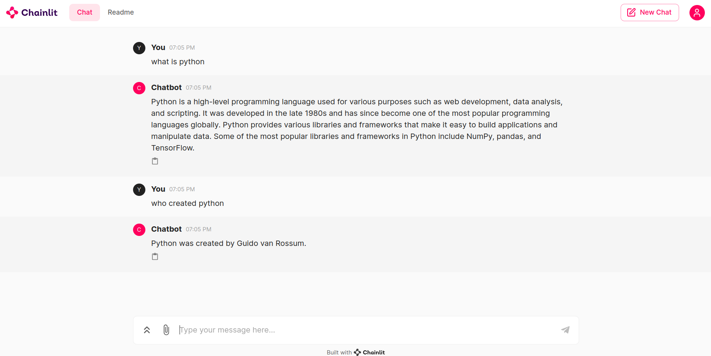
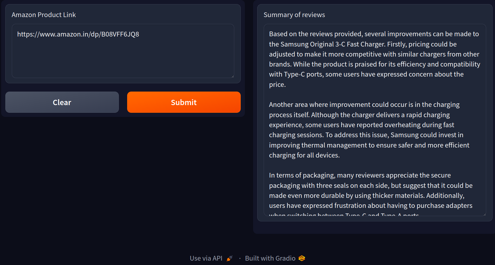
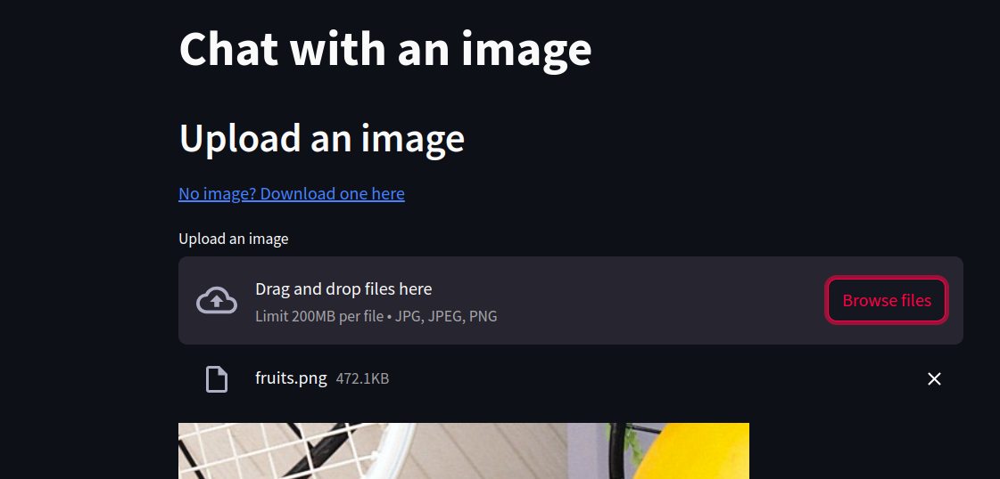
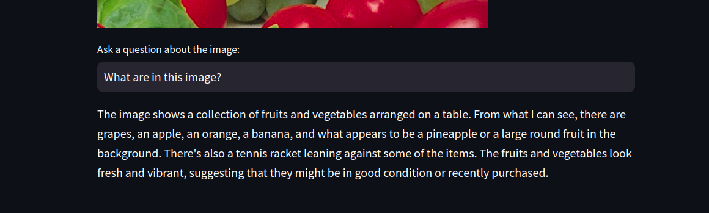
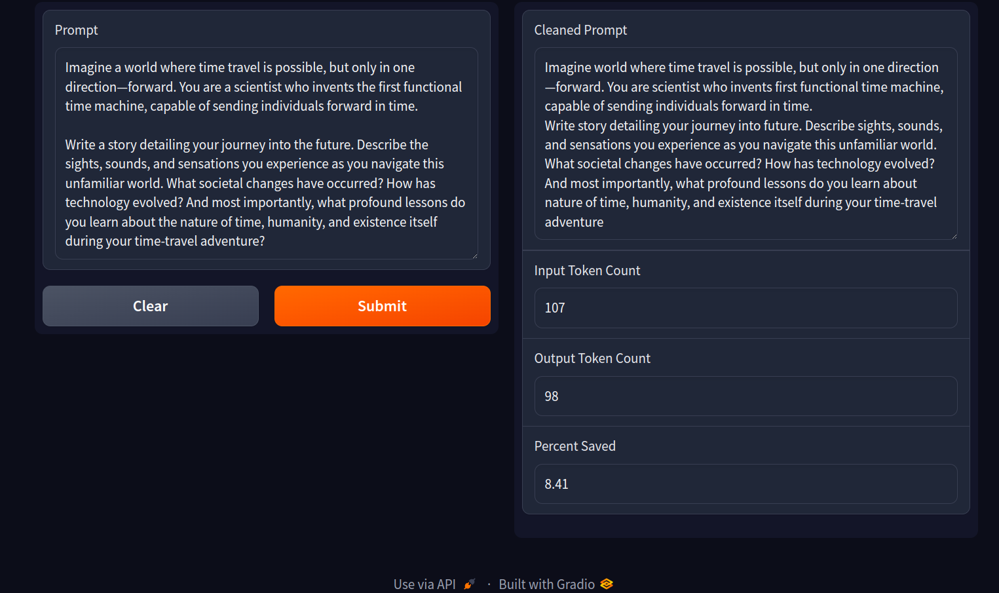

LLM LangChain projects:
- [LLMs - Chat with a Wikipedia page](/projects/LLM_Chat_with_Wikipedia_page.ipynb)
	

- [LLMs - Feedback summarizer](/projects/LLM_Feedback_summarizer.ipynb)
	

- [LLMs - Chat with an image](/projects/LLM_Image_chat.py)
	
	

- [LLMs - Prompt shortener](/projects/LLM_Prompt_shortener.ipynb)

	Note: Code is being improved a lot, and a more powerful LLM model will be used.
	

